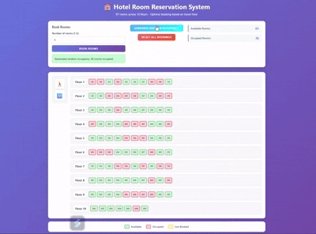

# Hotel_Reservation_System

### Description

**The Hotel Room Reservation System** is a web-based application that simulates a 10-floor hotel with 97 rooms. Users can:

- Book between 1–5 rooms,
- View available and occupied rooms,
- Reset all bookings,
- Generate random occupancy scenarios.
  
The system aims to minimize travel time between booked rooms by selecting optimal combinations.

### Features

- **Visual Booking Interface**: Users can visually see and book rooms floor-wise.
- **Optimal Room Selection Algorithm**: Ensures the shortest total travel time between rooms using both vertical and horizontal calculations.
- **Random Occupancy Generator**: Simulates real-world booking patterns by occupying 30–60% of rooms randomly.
- **Reset Bookings**: Instantly clears all reservations and resets the system.
- **Live Stats**: Displays available and occupied room counts in real-time.
- **Responsive Design**: Fully responsive UI for desktop and mobile screens.

### JavaScript Techniques

- **Classes**: HotelReservationSystem is a class encapsulating the entire system.
- **DOM Manipulation**: Uses document.createElement, addEventListener, and innerHTML to build the UI dynamically.
- **Event Handling**:	Handles click events for buttons like "Book Rooms", "Generate Random", and "Reset".
- **Set and Map**:	Uses Set for occupiedRooms and selectedRooms to manage state efficiently.
- **Custom Algorithms**:	Includes travel time calculation and optimal room selection using combinations and heuristics.
- **Animations and Styling**:	UI feedback with .selected, .available, .occupied class toggles and CSS animations.
- **Timeouts**:	Uses setTimeout to clear selection highlights after a delay.
- **Sorting and Filtering**:	Filters and sorts rooms by floor and position during booking logic.
- **Input Validation**:	Ensures booking only happens for room counts between 1 and 5.

### JavaScript functionality:

- **initializeRooms()**:
- **Description**:
  
- Creates a total of 97 rooms distributed across 10 floors:
- Floors 1–9 → 10 rooms each (e.g., 101–110, 201–210)
- Floor 10 → 7 rooms (1001–1007)
- Each room is stored as an object with floor, position, and occupied status.

- **renderHotel()**:
- **Description**:
  
- Dynamically renders the visual layout of the hotel using the DOM.
- Floors are shown from top (10) to bottom (1)
- Rooms are styled as available, occupied, or selected
- It updates after every booking or reset

**bindEvents()**:
- **Description**:

- Attaches click event listeners to all key buttons:
- Book Rooms
- Generate Random Occupancy
- Reset Bookings

**bookRooms(requestedCount)**
- **Description**:

- Books a user-specified number of rooms (1–5) based on:
- Availability
- Minimum travel time
- Optimal room grouping (same floor preferred)

- **After booking, it**:
- Highlights booked rooms temporarily
- Updates room states and stats
- Displays success/error messages

**generateRandomOccupancy()**
- **Description:**

- Simulates real hotel usage by randomly occupying 30–60% of total rooms.
- Resets existing bookings before applying new occupancy
- Updates the UI and room stats

**resetAllBookings()**
- **Description**:

- Clears all occupied and selected rooms and restores the hotel to its initial state.
- Also refreshes the visual layout and room stats.

**calculateTravelTime(room1, room2)**
- **Description**:

- Calculates time (in minutes) to travel between two rooms using:
- 2 min per floor (vertical)
- 1 min per room (horizontal, same floor only)

**calculateTotalTravelTime(roomNumbers[])**
- **Description**:

- Computes the total travel time required to visit all booked rooms in the given order.
- Useful for determining the best room combination.

**getAvailableRooms()**
- **Description**:

- Returns a list of currently unoccupied room numbers.
- Used during room selection and booking.

**findOptimalRooms(requestedCount)**
- **Description**:

- Tries to find the best set of available rooms for the requested count:
- Same-floor selection (priority)
- Cross-floor selection using travel-time-based combination logic

**findOptimalCrossFloorCombination(availableRooms, count)**
- **Description**:

- Finds the combination of rooms across floors that results in the minimum total travel time.

**getCombinations(arr, k)**
- **Description**:

- Generates all k-length combinations of the input array.
- Used to explore room grouping possibilities.

**getHeuristicCombinations(arr, k)**
- **Description**:

- For larger data sets, this function creates efficient room combinations without checking every possibility.
- Optimized for speed by prioritizing adjacency and floor grouping.

**generateFloorBasedCombinations()**
- **Description**:

- Part of the heuristic logic — creates room groupings centered around a starting floor and expands to others as needed.

**updateStats()**
- **Description**:

- Updates the UI counters for:
- Available Rooms
- Occupied Rooms
- Runs after every booking, reset, or random generation.

**showBookingResult(message, type)**
- **Description**:

- Displays dynamic feedback in the UI for user actions.
- type = 'success' → Green background
- type = 'error' → Red background
